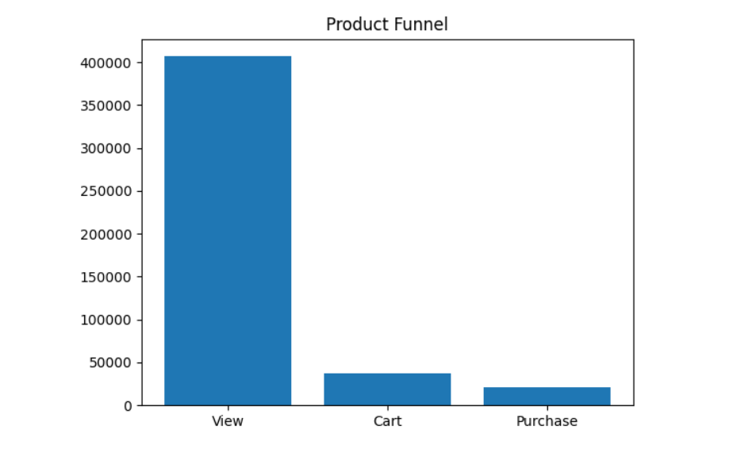
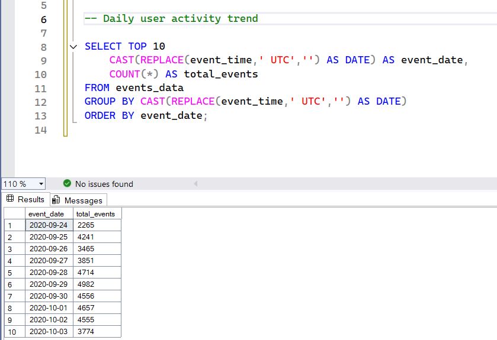
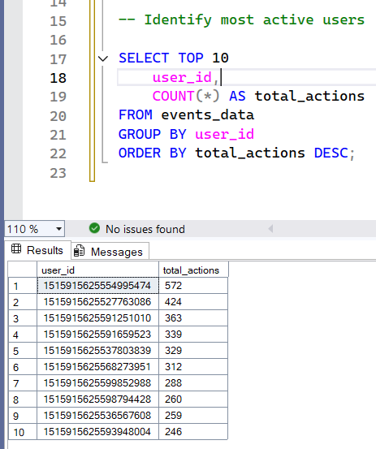
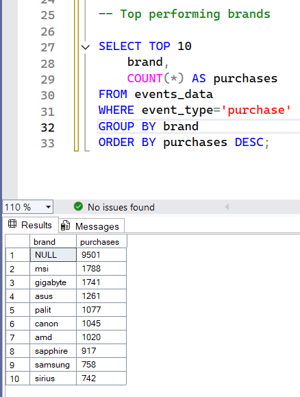

# Product Funnel Analysis

This project analyzes user behavior in an e-commerce platform using Python and SQL.  
The goal is to understand how users move through the product funnel (View → Cart → Purchase) and identify insights about user activity and product performance.

## Tools Used
- Python
- Pandas
- Matplotlib
- SQL Server

## Project Analysis

### 1. Product Funnel Analysis
Analyzed how users move through different stages of the product funnel:
View → Cart → Purchase.

### 2. Daily User Activity
Used SQL queries to analyze daily user engagement on the platform.

### 3. Most Active Users
Identified the users who performed the highest number of actions.

### 4. Top Brands by Purchases
Analyzed which brands generated the highest number of purchases.

## SQL Insights
Some of the key SQL queries used in the project:
- Daily user activity analysis
- Most active users
- Top brands by purchases
- Category popularity
- Average purchase price

## Project Structure
